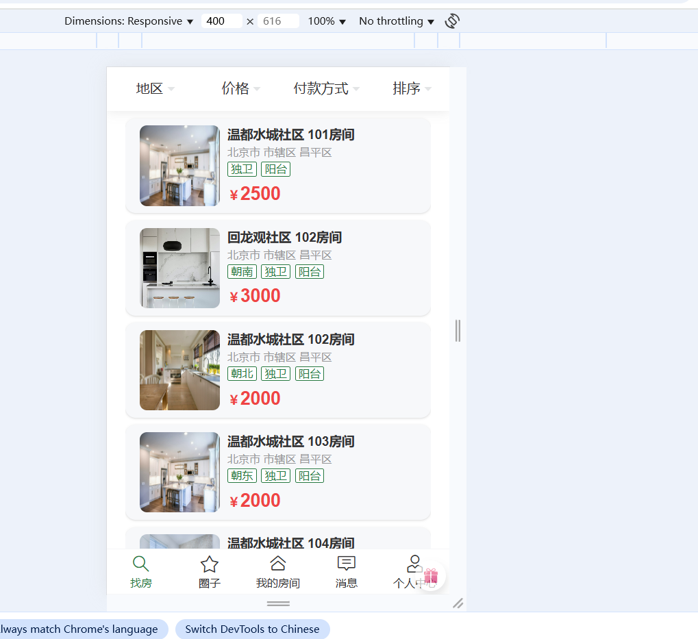
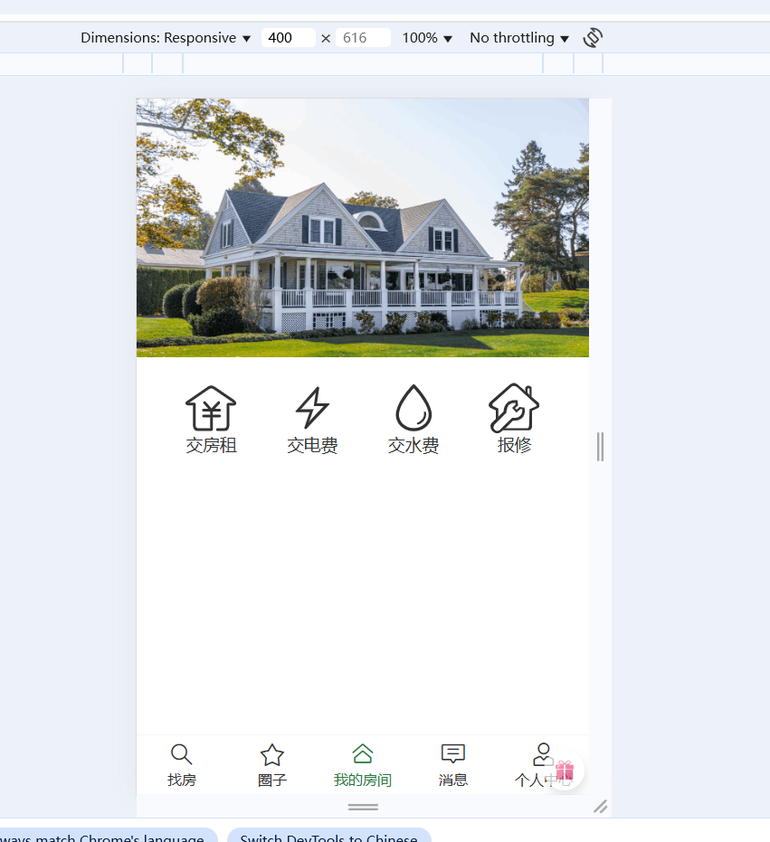
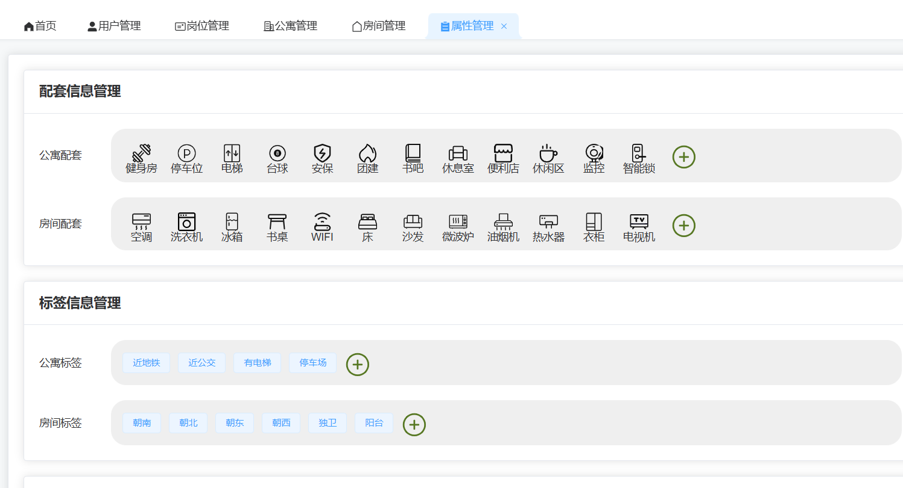
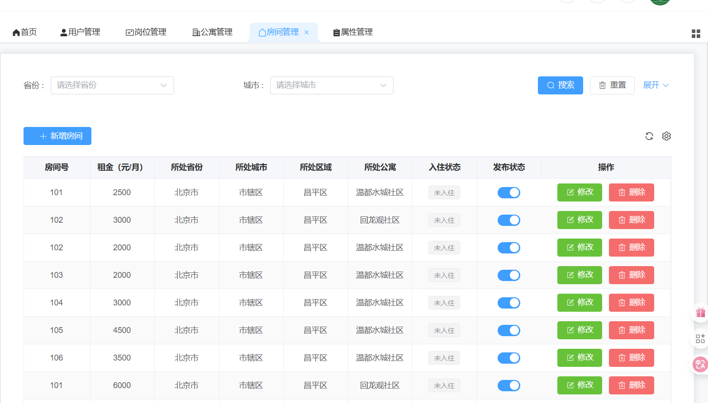
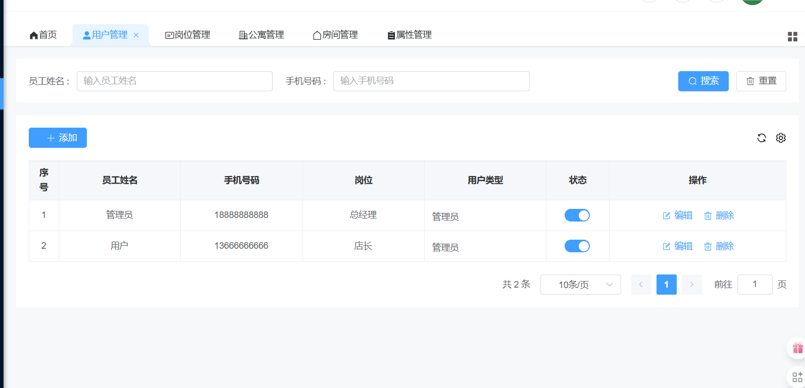
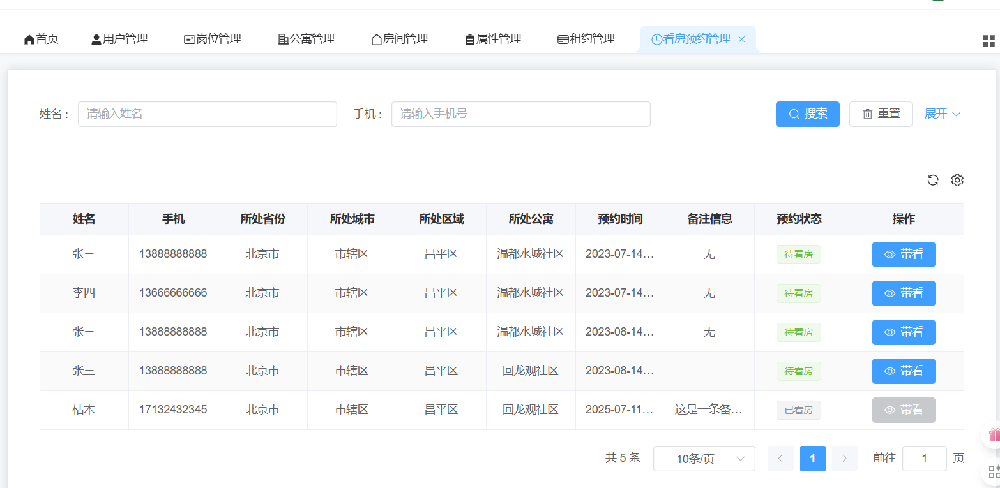

# 1、系统的介绍

这是一个围绕租房展开的系统，主要的功能是房东上架新的房屋，相关的公寓，租户可以预约看房后，由房东带看，确定是否需要签订租约

# 2、页面

## 小程序端







## 后端管理









# 3、主要涉及的难点

## 	前后端数据格式的转换

使用了枚举类型：

- **请求流程**

  

  **说明**

  - SpringMVC中的`WebDataBinder`组件负责将HTTP的请求参数绑定到Controller方法的参数，并实现参数类型的转换。
  - Mybatis中的`TypeHandler`用于处理Java中的实体对象与数据库之间的数据类型转换。

  **由前端向后端发送请求**

  **过程为json数据，需要将其转换为String的数据**

  **我们可以使用一个Converter来将json转为string类型的数据**

  **但是这样的话我们就需要对每一个枚举类型都添加一个Converter**

  ```java
  @Component
  public class StringToItemTypeConverter implements Converter<String, ItemType> {
      @Override
      public ItemType convert(String code) {
  
          for (ItemType value : ItemType.values()) {
              if (value.getCode().equals(Integer.valueOf(code))) {
                  return value;
              }
          }
          throw new IllegalArgumentException("code非法");
      }
  }
  ```

  **我们放每一个枚举类都继承一个接口**

  ```java
  public interface BaseEnum {
      Integer getCode();
      String getName();
  }
  ```

  **这样就只需要让接口去做类型转换就可以了**

  代码为：

  ```java
  @Component
  public class StringToBaseEnumConverterFactory implements ConverterFactory<String, BaseEnum> {
      @Override
      public <T extends BaseEnum> Converter<String, T> getConverter(Class<T> targetType) {
          return new Converter<String, T>() {
              @Override
              public T convert(String source) {
  
                  for (T enumConstant : targetType.getEnumConstants()) {
                      if (enumConstant.getCode().equals(Integer.valueOf(source))) {
                          return enumConstant;
                      }
                  }
                  throw new IllegalArgumentException("非法的枚举值:" + source);
              }
          };
      }
  }
  ```

  

- **响应流程**

  

  **说明**

  - SpringMVC中的`HTTPMessageConverter`组件负责将Controller方法的返回值（Java对象）转换为HTTP响应体中的JSON字符串，或者将请求体中的JSON字符串转换为Controller方法中的参数（Java对象），例如下一个接口**保存或更新标签信息**

    ==**过程是由SpringMvc与数据发送数据交互**==

- **TypeHandler枚举类型转换**

  Mybatis预置的`TypeHandler`可以处理常用的数据类型转换，例如`String`、`Integer`、`Date`等等，其中也包含枚举类型，**但是枚举类型的默认转换规则是枚举对象实例（ItemType.APARTMENT）和实例名称（"APARTMENT"）相互映射**。若想实现`code`属性到枚举对象实例的相互映射，需要自定义`TypeHandler`。

  不过MybatisPlus提供了一个[通用的处理枚举类型的TypeHandler](https://baomidou.com/pages/8390a4/)。其使用十分简单，只需在`ItemType`枚举类的`code`属性上增加一个注解`@EnumValue`，Mybatis-Plus便可完成从`ItemType`对象到`code`属性之间的相互映射，具体配置如下。

  ```java
  public enum ItemType {
  
      APARTMENT(1, "公寓"),
      ROOM(2, "房间");
  
      @EnumValue
      private Integer code;
      private String name;
  
      ItemType(Integer code, String name) {
          this.code = code;
          this.name = name;
      }
  }
  ```

  ==**由SpringMvc向前端返回数据**==

  - **HTTPMessageConverter枚举类型转换**

    `HttpMessageConverter`依赖于Json序列化框架（默认使用Jackson）。其对枚举类型的默认处理规则也是枚举对象实例（ItemType.APARTMENT）和实例名称（"APARTMENT"）相互映射。不过其提供了一个注解`@JsonValue`，同样只需在`ItemType`枚举类的`code`属性上增加一个注解`@JsonValue`，Jackson便可完成从`ItemType`对象到`code`属性之间的互相映射。具体配置如下，详细信息可参考Jackson[官方文档](https://fasterxml.github.io/jackson-annotations/javadoc/2.8/com/fasterxml/jackson/annotation/JsonValue.html)。

    ```java
    @Getter
    public enum ItemType {
    
        APARTMENT(1, "公寓"),
        ROOM(2, "房间");
    
        @EnumValue
      	@JsonValue
        private Integer code;
        private String name;
    
        ItemType(Integer code, String name) {
            this.code = code;
            this.name = name;
        }
    }
    ```

  ##### 

## 全局异常处理

```java
package com.atguigu.lease.common.exception;

import com.atguigu.lease.common.result.Result;
import org.springframework.web.bind.annotation.ExceptionHandler;
import org.springframework.web.bind.annotation.RestControllerAdvice;

@RestControllerAdvice
public class GlobalExceptionHandler {


    @ExceptionHandler(Exception.class)
    public Result handle(Exception e) {
        e.printStackTrace();
        return Result.fail();
    }


    @ExceptionHandler(LeaseException.class)
    public Result handle(LeaseException e) {
        String message = e.getMessage();
        Integer code = e.getCode();
        e.printStackTrace();
        return Result.fail(code, message);
    }
}

```


1. `@RestControllerAdvice` 注解：

   这是一个Spring MVC提供的组合注解，结合了`@ControllerAdvice`和`@ResponseBody`

   表示这个类是一个全局异常处理器，会拦截所有Controller抛出的异常

2. `GlobalExceptionHandler` 类：

   包含两个异常处理方法，分别处理不同类型的异常

3. 第一个方法 `@ExceptionHandler(Exception.class)`：

   处理所有`Exception`及其子类的异常（通用异常处理）

   方法内做了两件事：

   `e.printStackTrace()`：打印异常堆栈信息到控制台（用于调试）

   `return Result.fail()`：返回一个通用的失败响应

4. 第二个方法 `@ExceptionHandler(LeaseException.class)`：

   专门处理自定义的`LeaseException`异常

   方法内做了三件事：

   从异常中获取`message`和`code`

   `e.printStackTrace()`：打印异常堆栈信息

   `return Result.fail(code, message)`：返回带有特定错误码和消息的失败响应

这种设计模式的优点：

1. 统一异常处理，避免在每个Controller中重复处理异常
2. 可以区分不同类型的异常，返回不同的错误信息
3. 保持了API响应格式的一致性
4. 便于集中记录和监控异常

## 异步处理

在保存历史的时候，不能够影响前端获取页面的行为，所以要采用异步的操作

在SpringBootApp上添加`@EnableAsync`注解，开启异步功能

```java
@SpringBootApplication
@EnableAsync
public class AppWebApplication {
    public static void main(String[] args) {
        SpringApplication.run(AppWebApplication.class);
    }
}
```

在所需要进行异步处理的类上加上@Async注解即可

```java
@Async
public  class xxx 

```

## 定时任务

需要==开启定时任务来检查租约是否到期==

在springbootApp上添加注解

```java
@SpringBootApplication
@EnableScheduling
public class AdminWebApplication {
    public static void main(String[] args) {
        SpringApplication.run(AdminWebApplication.class, args);
    }
}
```

编写定时任务代码：

```java
@Component
public class ScheduledTasks {

    @Autowired
    private LeaseAgreementService leaseAgreementService;

    @Scheduled(cron = "0 0 0 * * *")
    public void checkLeaseStatus() {

        LambdaUpdateWrapper<LeaseAgreement> updateWrapper = new LambdaUpdateWrapper<>();
        Date now = new Date();
        updateWrapper.le(LeaseAgreement::getLeaseEndDate, now);
        updateWrapper.eq(LeaseAgreement::getStatus, LeaseStatus.SIGNED);
        updateWrapper.in(LeaseAgreement::getStatus, LeaseStatus.SIGNED, LeaseStatus.WITHDRAWING);

        leaseAgreementService.update(updateWrapper);
    }
}
```

使用`@TableField`注解来避免password字段被select明文查询出来
